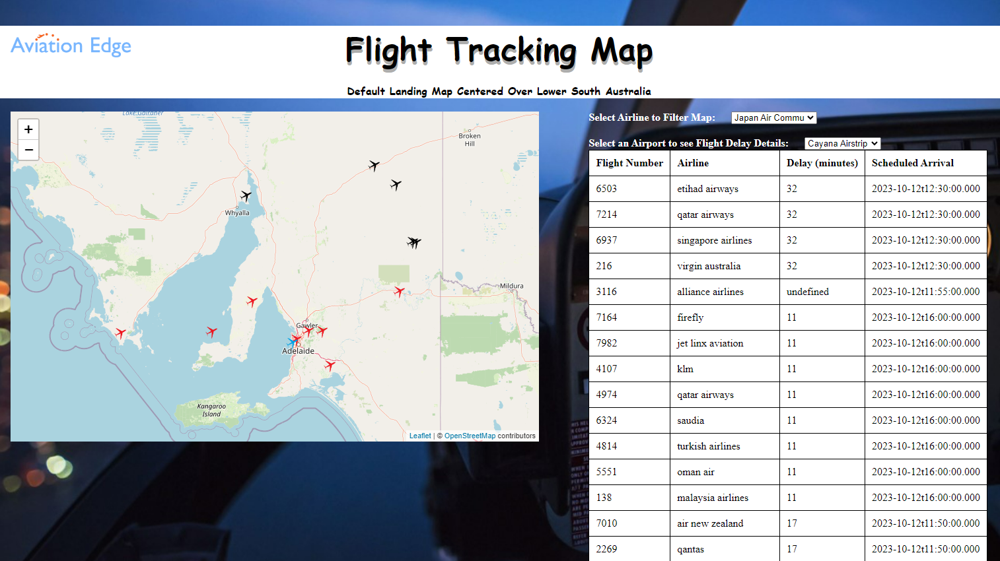
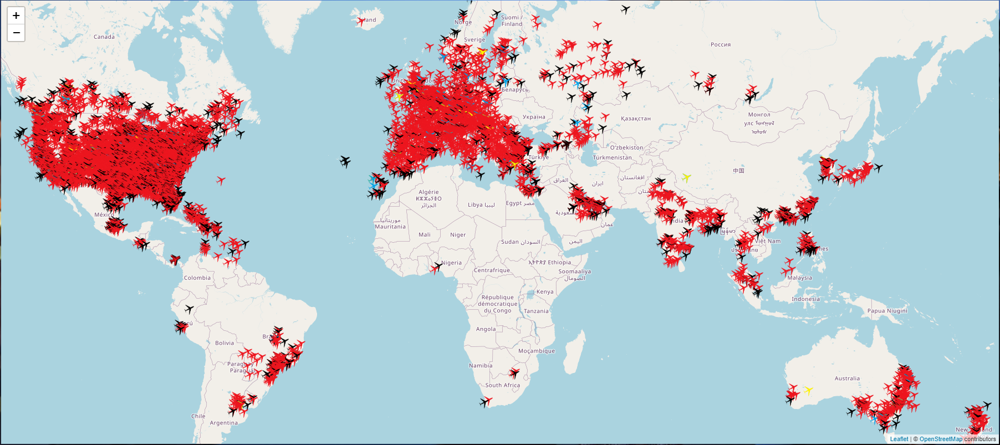
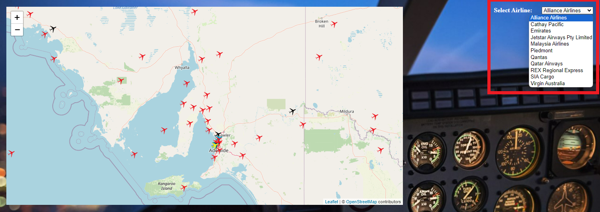
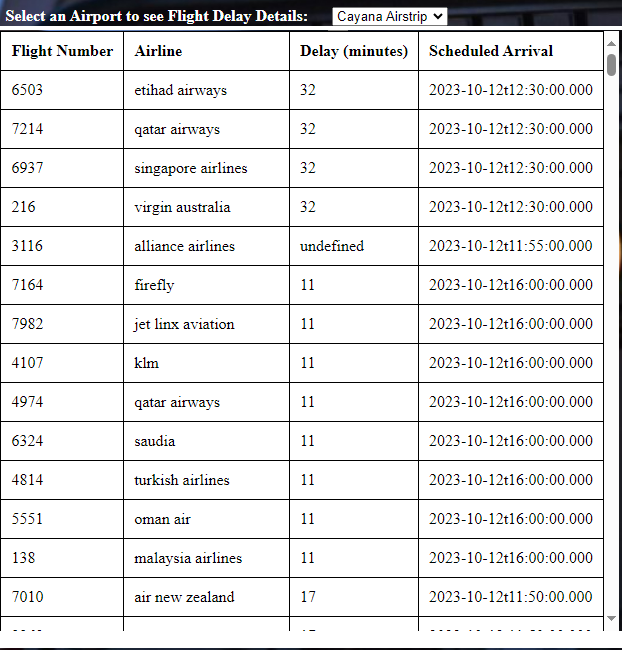
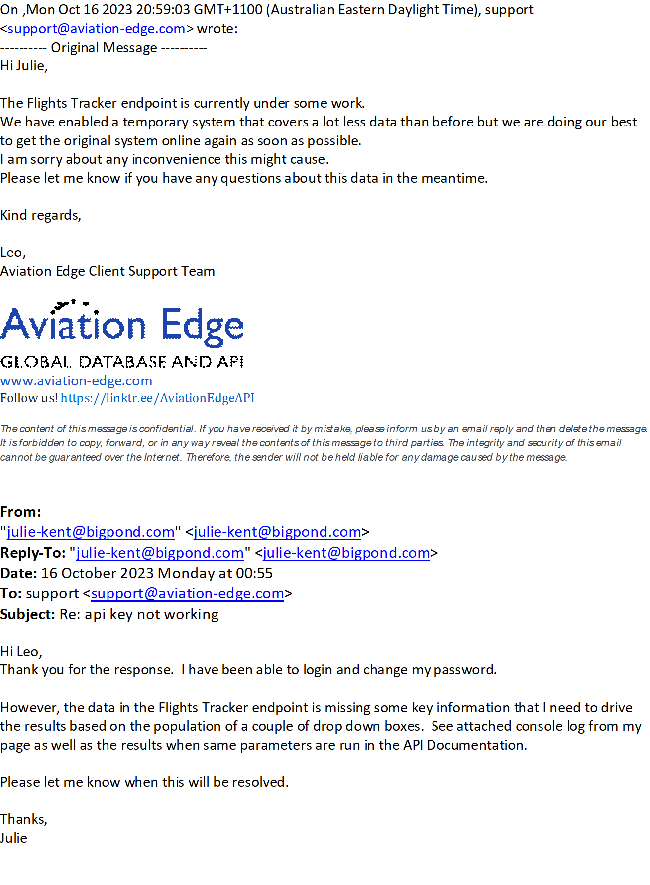
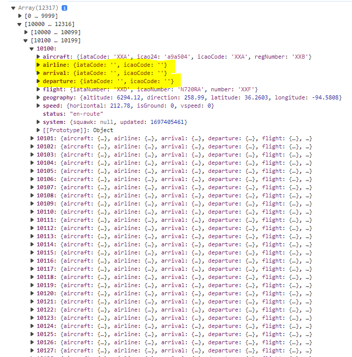
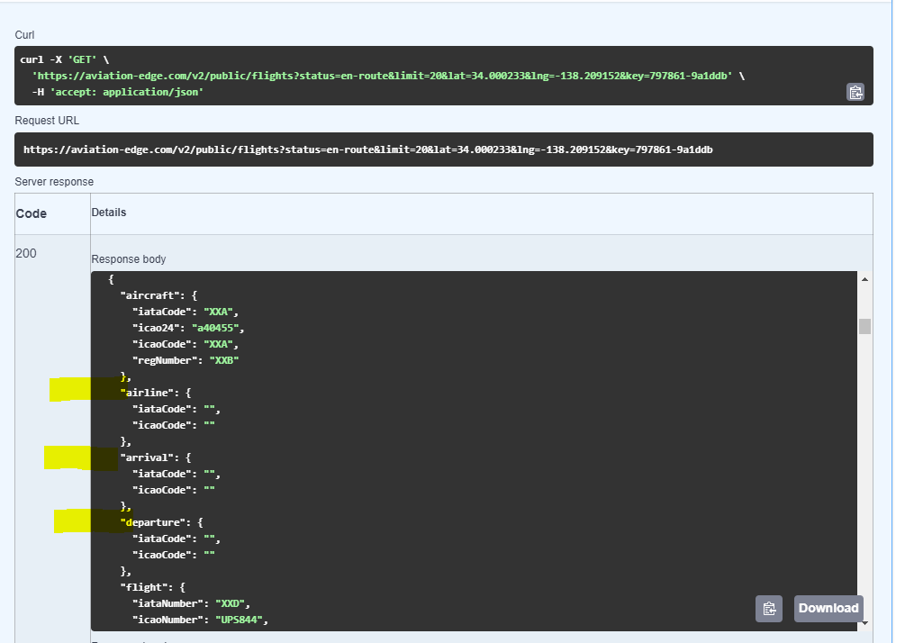

# Project 3 - Aviation Edge Flight Tracking Map

## A dymanic leaflet map drawing on API endpoints sourced from [Aviation Edge](https://aviation-edge.com/developers/)

### Airplane Colours

| Colour | Red | Yellow | Blue | Black |
| ----------- | :-----------: | :-----------: | :-----------: | :-----------: |
| **Icon** |  |  |  |  |
| **Status** | en-route | started | landed | other |

## User Driven View

**Users can adjust the span of information by zooming in and out on the map or click and drag to different geographical areas to view current flight information within the visible map area.**

**Users can further filter the map by slecting an airline from the dropdown box.  The dropdown box is filtered based on airlines that have flights visible in the current map bounds.**

**Users are presented with a scrollable list of historical flight delay information for the last five (5) days related to the airport the user selects from the dropdown.**

## API Endpoints Use and Purpose

Flight details that populate the map:

https://aviation-edge.com/v2/public/flights

Airline database to populate the Airlines dropdown box:

https://aviation-edge.com/v2/public/airlineDatabase

Airports database to populate the Airports dropdown box:

https://aviation-edge.com/v2/public/airportDatabase

Flights History to populate the Flight Delays Table based on the selected airport:

https://aviation-edge.com/v2/public/flightsHistory

## Challenges with source APIs

When working with live api endpoints, there is always a reliance on the information in the endpoint being up to date and complete however, this is not always the case.

As at the time of submitting this project for assessment and after raising a support enquiry with Aviation Edge, we have found that there is key information missing from the Flight Tracking API endpoint critical to enabling the full utilisation of our developed webpage.  

Dependencies:

* To enable the filtering of the airline dropdown based on airlines visible in the current map area, the airlines database is filtered using the airline IATA code for each airline visible in the map area.  As the Airline IATA code is currently missing from the Flight Tracker API, we are not able to acurately show the list of visible airlines however, once the api data is corrected, the webpage will auto correct itself and populate the airlines dropdown box without additional coding required.

* As is the case with the airlines dropdown, to enable filtering of the airports dropdown based on airports visible in the current map area, the airports database is filtered based on the departure airport IATA code which is also currently missing from the Flight Tracker API.  To enable demonstration of the flight delays table, we have hard coded the airport parameter to show ADL (Adelaide Internation Airport) delay information.  The javascript coding will need to be adjusted to use the "selectedAirport" constant within the API url once the missing information is avialble.

*Following is a screen shot of the enquiry and response from Aviation Edge support:*

  |  
